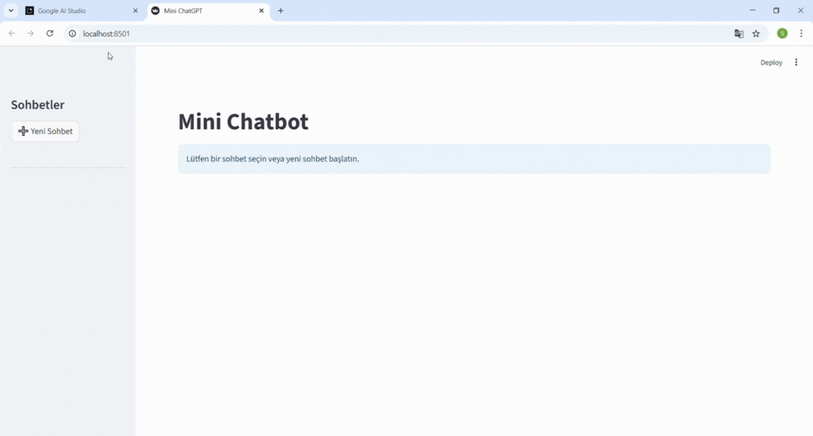

# 🌟 Mini Gemini Chatbot with Streamlit

A mini chatbot using **Google Gemini API** built with **Streamlit**.  
Quick, clean and interactive demo to show how you can connect a Streamlit UI with Google’s Gemini model.

---



---

## 🔎 About
This project showcases a lightweight chat application where users can interact with a Google Gemini model in real time via a Streamlit interface.  
It is designed as a **demo project**, a **portfolio piece**, or a **starting point** for production-grade AI assistants.

---

## ✨ Features
- 🧠 Powered by **Google Gemini 1.5 Turbo** via `google-generativeai`
- 🖥️ Modern and minimal **Streamlit** UI with `st.chat_message` & `st.chat_input`
- 💬 Multiple conversations handled using `st.session_state`
- 📝 Easy configuration via environment variables or Streamlit secrets
- 🎥 Demo GIF included for instant visual impression

---

## 🛠 Tech Stack
- [Python](https://www.python.org/) – Core language
- [Streamlit](https://streamlit.io/) – UI framework
- [Google Gemini API](https://ai.google.dev/) – LLM backend

---

## 🚀 Quick Start

### Prerequisites
- Python 3.9+
- A Google Cloud API key for the Gemini/Generative AI service

### Install
```bash
git clone https://github.com/your-username/mini-gemini-chatbot.git
cd mini-gemini-chatbot
pip install -r requirements.txt

### Run
streamlit run chatbot_app.py
``` 
---
## 🛠 Tech Stack
```bash
mini-gemini-chatbot/
│
├── chatbot_app.py        # Main Streamlit app
├── chatbot.py            # Core chatbot logic (Gemini API)
├── requirements.txt      # Dependencies
├── assets/
│   └── demo.gif          # Demo preview
└── README.md             # Documentation
``` 
---

## 🔮 Future Improvements / To-Do
📝 Smart Conversation Summaries – Automatically summarize chats instead of generic titles, making it easier to review and manage past conversations.

📂 File & Document Upload – Allow users to upload PDFs or text files so the chatbot can answer questions based on uploaded content.

🎨 UI Enhancements – Introduce dark mode, theme customization, and more interactive visual elements for a modern user experience.

💾 Persistent Memory – Save chat history across sessions for a continuous, context-aware conversation.

🌐 Deployment Ready – Prepare the app for hosting on Streamlit Cloud or Hugging Face Spaces, making it accessible online.

🤖 Advanced AI Features – Implement multi-turn reasoning, context tracking, and personalized responses for smarter interactions.
